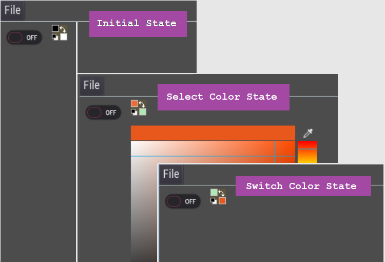

# PigMint Controls
A plugin which provides custom controls (mainly for drawing apps) for [Godot Engine](https://godotengine.org/). In this first release, there **PigletColorSelect**, it's a Color Picker button. 
It provides a mean for the user to select Foreground/Background colors.



## How to install the Plugin?
To install this plugin, create a **addons** folder at the root of your *Godot* project then copy **pigmint_controls** folder into it.
You should have the following: `my_godot_project/addons/pigmint_controls`.

## Interactions
Once you add a `PigletColorSelect` to your scene (e.g. as a child of `HBoxContainer` or `VBoxContainer`), this will display a small 24x24 icon which is divided in 4 **parts** thus allowing *4 interactions*:
1. *Select Foreground color*: a left mouse button click in the small square of the top left part. This will popup a `ColorPicker` which allows the user to select a color.
2. *Select Background color*: a click in the small square in the bottom right part. This will also popup a `ColorPicker`.
3. *Switch Foreground/Background colors*: a click on the double arrow in the top right part.
4. *Reset Foreground/Background colors*: a click on the bottom left part (a tiny white square under a tiny black square).

## Events
There are 4 custom signals which can be connected to your nodes to handle the *4 interactions*:
1. `foreground_color_changed(fg_color)`: connected function receives the *Foreground color* when it has been changed.
2. `background_color_changed(bg_color)`: connected function receives the *Background color* when it has been changed.
3. `colors_switch(piglet_color_select_control)`: connected function receives the `PigletColorSelect` button when the user *Switches* colors.
4. `colors_reset(piglet_color_select_control)`: connected function receives the `PigletColorSelect` button when the user *Resets* colors.

## Properties
There are 2 properties on `PigletColorSelect`. They can be accessed with setters and getters:
1. `ForegroundColor`
```
	set_foreground_color(color)
	get_foreground_color()
```
2. `BackgroundColor`	
```
	set_background_color(color)
	get_background_color()
```
